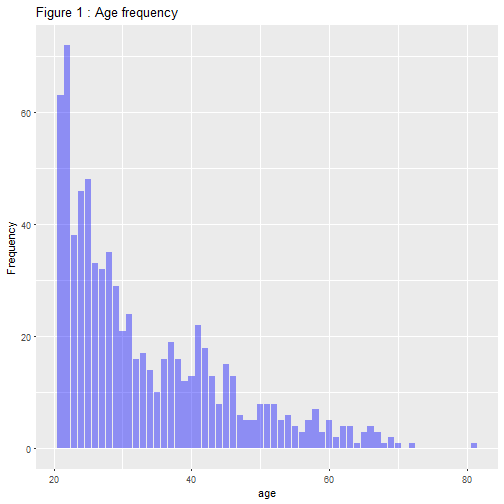
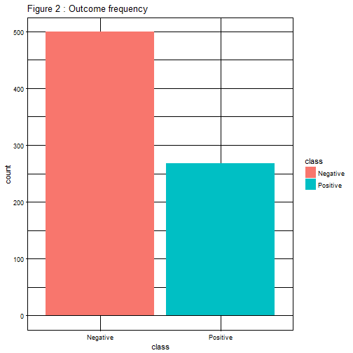
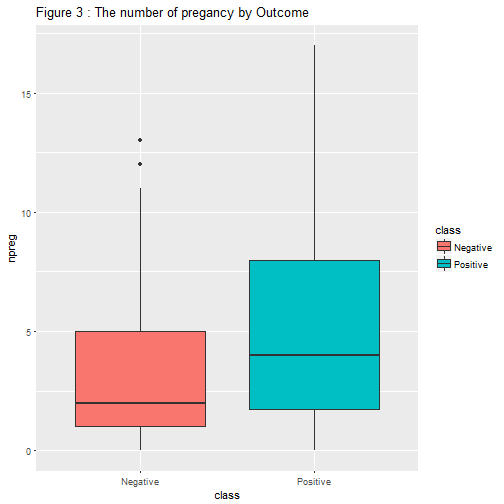
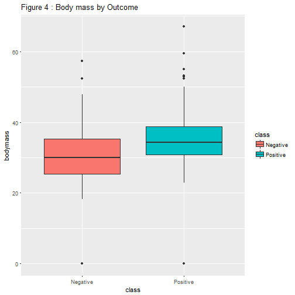
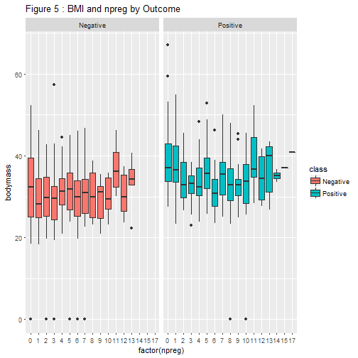

                          # Diabetes in Pima Indian Women


                                  **Author: ABAS-Hamza**                          
.
.
.
.
.
.
.
.
.
.
.


## Overview

A population of women who were at least 21 years old, of Pima Indian heritage and living near Phoenix, Arizona, was tested for diabetes according to World Health Organization criteria. The data were collected by the US National Institute of Diabetes and Digestive and Kidney Diseases. To understand more about the diseas factor We are going to test whether there is a relationship between different Variables : BMI body mass index (weight in kg) and plasma glucose concentration in an oral glucose tolerance test (plasmaglu), relationship between the test results for diabetes and the pedigree function, The relationship between The age and numbe of pregnancies and  the relationship between Class variable which is a factor Yes or No or(1, 0), for diabetic according to WHO criteria and age variable.


**Downloading the data**

I provided The link to get the data and I'll show you bellow how to get it from the web, but the working data I'm using is already downloaded and stored in my local directory.


###url <-  "https://archive.ics.uci.edu/ml/machine-learning-databases/pima-indians-diabetes/pima-indians-diabetes.data".

 ###example <- read.table(url,fileEncoding="UTF-8", sep=",")
 
 
 
 


```r
data1 <- read.csv("diabetes.csv")
```


We need to change the variable names, because the older column names of the data are not meaningful


```r
names <- c("npreg","plasmaglu","pressure","skin","Serum_Insulin",
           "bodymass","diabetespedi","age","class")

colnames(data1) <- names
```

Summarising the data


```r
summary(data1)
```

```
##      npreg          plasmaglu        pressure           skin      
##  Min.   : 0.000   Min.   :  0.0   Min.   :  0.00   Min.   : 0.00  
##  1st Qu.: 1.000   1st Qu.: 99.0   1st Qu.: 62.00   1st Qu.: 0.00  
##  Median : 3.000   Median :117.0   Median : 72.00   Median :23.00  
##  Mean   : 3.845   Mean   :120.9   Mean   : 69.11   Mean   :20.54  
##  3rd Qu.: 6.000   3rd Qu.:140.2   3rd Qu.: 80.00   3rd Qu.:32.00  
##  Max.   :17.000   Max.   :199.0   Max.   :122.00   Max.   :99.00  
##  Serum_Insulin      bodymass      diabetespedi         age       
##  Min.   :  0.0   Min.   : 0.00   Min.   :0.0780   Min.   :21.00  
##  1st Qu.:  0.0   1st Qu.:27.30   1st Qu.:0.2437   1st Qu.:24.00  
##  Median : 30.5   Median :32.00   Median :0.3725   Median :29.00  
##  Mean   : 79.8   Mean   :31.99   Mean   :0.4719   Mean   :33.24  
##  3rd Qu.:127.2   3rd Qu.:36.60   3rd Qu.:0.6262   3rd Qu.:41.00  
##  Max.   :846.0   Max.   :67.10   Max.   :2.4200   Max.   :81.00  
##      class      
##  Min.   :0.000  
##  1st Qu.:0.000  
##  Median :0.000  
##  Mean   :0.349  
##  3rd Qu.:1.000  
##  Max.   :1.000
```


The Structure of the data


```r
str(data1)
```

```
## 'data.frame':	768 obs. of  9 variables:
##  $ npreg        : int  6 1 8 1 0 5 3 10 2 8 ...
##  $ plasmaglu    : int  148 85 183 89 137 116 78 115 197 125 ...
##  $ pressure     : int  72 66 64 66 40 74 50 0 70 96 ...
##  $ skin         : int  35 29 0 23 35 0 32 0 45 0 ...
##  $ Serum_Insulin: int  0 0 0 94 168 0 88 0 543 0 ...
##  $ bodymass     : num  33.6 26.6 23.3 28.1 43.1 25.6 31 35.3 30.5 0 ...
##  $ diabetespedi : num  0.627 0.351 0.672 0.167 2.288 ...
##  $ age          : int  50 31 32 21 33 30 26 29 53 54 ...
##  $ class        : int  1 0 1 0 1 0 1 0 1 1 ...
```

How the head of the data looks like


```r
 library(knitr)
 x <- head(data1, n =12)
 
 kable(x, align = "c")
```


| npreg | plasmaglu | pressure | skin | Serum_Insulin | bodymass | diabetespedi | age | class |
|:-----:|:---------:|:--------:|:----:|:-------------:|:--------:|:------------:|:---:|:-----:|
|   6   |    148    |    72    |  35  |       0       |   33.6   |    0.627     | 50  |   1   |
|   1   |    85     |    66    |  29  |       0       |   26.6   |    0.351     | 31  |   0   |
|   8   |    183    |    64    |  0   |       0       |   23.3   |    0.672     | 32  |   1   |
|   1   |    89     |    66    |  23  |      94       |   28.1   |    0.167     | 21  |   0   |
|   0   |    137    |    40    |  35  |      168      |   43.1   |    2.288     | 33  |   1   |
|   5   |    116    |    74    |  0   |       0       |   25.6   |    0.201     | 30  |   0   |
|   3   |    78     |    50    |  32  |      88       |   31.0   |    0.248     | 26  |   1   |
|  10   |    115    |    0     |  0   |       0       |   35.3   |    0.134     | 29  |   0   |
|   2   |    197    |    70    |  45  |      543      |   30.5   |    0.158     | 53  |   1   |
|   8   |    125    |    96    |  0   |       0       |   0.0    |    0.232     | 54  |   1   |
|   4   |    110    |    92    |  0   |       0       |   37.6   |    0.191     | 30  |   0   |
|  10   |    168    |    74    |  0   |       0       |   38.0   |    0.537     | 34  |   1   |

We need to make sure wether there are some missing values, We don need to drop the rows of missing values unless they are not significant, I mean it is not a good pratice to drop all the missing values but rather to deal with them, by replacing them.


```r
library(dplyr)
```

```
## 
## Attaching package: 'dplyr'
```

```
## The following objects are masked from 'package:stats':
## 
##     filter, lag
```

```
## The following objects are masked from 'package:base':
## 
##     intersect, setdiff, setequal, union
```

```r
missingvalues <- colSums(is.na(data1))
m1 <- count(data1,Serum_Insulin)
m1data <- as.data.frame(m1)
```

We are missing 374 records on serum insulin and 227 on skin variable. We have to solve this problem. 


```r
insulin_mean <- mean(data1$Serum_Insulin, na.rm = TRUE)
skin_mean <- mean(data1$skin, na.rm = TRUE)
data1$Serum_Insulin[data1$Serum_Insulin == 0] <- insulin_mean
data1$skin[data1$skin == 0] <- skin_mean
```


The variable class has 2 levels, is a Binary outcome 0 and 1, We change that by positive and negative since 0 means negative and 1 equal to positive.


```r
 data1$class[data1$class == 0] <- "Negative"
 data1$class[data1$class == 1] <- "Positive"

 x2 <- head(data1, n =12)
 
 kable(x2, align = "c")
```


| npreg | plasmaglu | pressure |   skin   | Serum_Insulin | bodymass | diabetespedi | age |  class   |
|:-----:|:---------:|:--------:|:--------:|:-------------:|:--------:|:------------:|:---:|:--------:|
|   6   |    148    |    72    | 35.00000 |   79.79948    |   33.6   |    0.627     | 50  | Positive |
|   1   |    85     |    66    | 29.00000 |   79.79948    |   26.6   |    0.351     | 31  | Negative |
|   8   |    183    |    64    | 20.53646 |   79.79948    |   23.3   |    0.672     | 32  | Positive |
|   1   |    89     |    66    | 23.00000 |   94.00000    |   28.1   |    0.167     | 21  | Negative |
|   0   |    137    |    40    | 35.00000 |   168.00000   |   43.1   |    2.288     | 33  | Positive |
|   5   |    116    |    74    | 20.53646 |   79.79948    |   25.6   |    0.201     | 30  | Negative |
|   3   |    78     |    50    | 32.00000 |   88.00000    |   31.0   |    0.248     | 26  | Positive |
|  10   |    115    |    0     | 20.53646 |   79.79948    |   35.3   |    0.134     | 29  | Negative |
|   2   |    197    |    70    | 45.00000 |   543.00000   |   30.5   |    0.158     | 53  | Positive |
|   8   |    125    |    96    | 20.53646 |   79.79948    |   0.0    |    0.232     | 54  | Positive |
|   4   |    110    |    92    | 20.53646 |   79.79948    |   37.6   |    0.191     | 30  | Negative |
|  10   |    168    |    74    | 20.53646 |   79.79948    |   38.0   |    0.537     | 34  | Positive |


In this section We are going to visualize the data in order to communicate information clearly and efficiently via statistical graphics, plots and information graphics. Effective visualization helps us finding new evidence . It makes complex data more accessible, understandable and usable. The graph bellow clearly shows that most of population age are between (20,40)


```r
 library(ggplot2)

 
 plot1 <- ggplot(data1, aes(x=age)) + 
         geom_bar(size=3, fill="blue", alpha=.4) +
         ggtitle("Age Frequency") + ylab("Frequency") + 
         ggtitle("Figure 1 : Age frequency")
 
 plot1
```




This graph shows that there are more negative cases than positive.

```r
plot2 <- ggplot(data1, aes(x=class, fill=class)) +
         geom_bar() + theme_linedraw() + 
         ggtitle("Figure 2 : Outcome frequency")
 
 plot2
```




```r
plot3 <- ggplot(data1, aes(x=class, y=npreg, fill=class)) +
         geom_boxplot() +
         ggtitle("Figure 3 : The number of pregancy by Outcome")

plot3
```



It seems that those who have been tested positive for diabete have higher count in pregnancy. Now let's see how an increase of body mass can  also increase the chance of having tested positive for diabetes.


```r
plot4 <- ggplot(data1, aes(x=class, y=bodymass, fill=class)) +
         geom_boxplot() +
         ggtitle("Figure 4 : Body mass by Outcome")

plot4
```




Again It seems that those who have been tested positive for diabete have higher body mass . The objectives of this study is to explore the relation between body mass index (BMI) and diabetes. According the plot, We can confirm that an increase in body fat is generally associated with increased risk of metabolic diseases such as type 2 diabetes, In addition, many patients with these metabolic diseases are either overweight or obese. Understanding the relationship between body weight and metabolic disease is critical toward a better understanding of the underlying processes leading to metabolic disease such as diabetes. Now We want to see if there is a relation between.


Now We focus on the relation between the number of pregnancy and the Body mass by the test results for diabetes.


```r
plot5 <- ggplot(data1, aes(x=factor(npreg), y=bodymass, fill=class)) +
           geom_boxplot() + 
           facet_grid(.~class) + 
            ggtitle("Figure 5 : BMI and npreg by Outcome ")
plot5
```




 We conclude that there is some form of an association between BMI and diabetes, Among individuals diagnosed as having diabetes, elevated BMIs were associated. Any increase in BMI above normal weight levels is associated with an increased risk of being diagnosed as having diabetes. We have seen those who have been tested positive for diabete have higher count in pregnancy.
