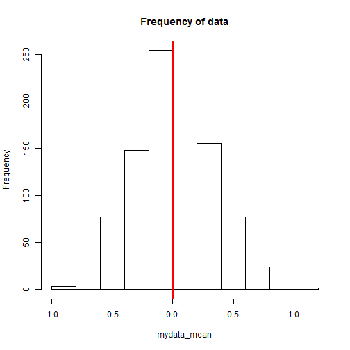
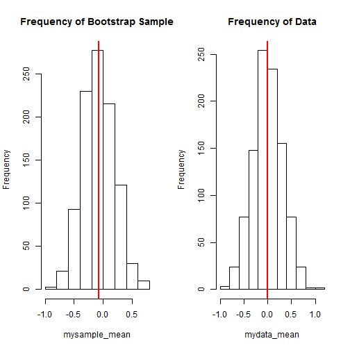
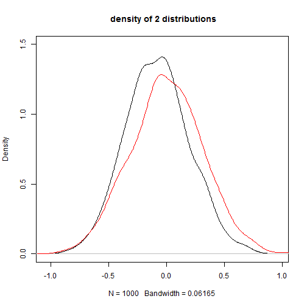
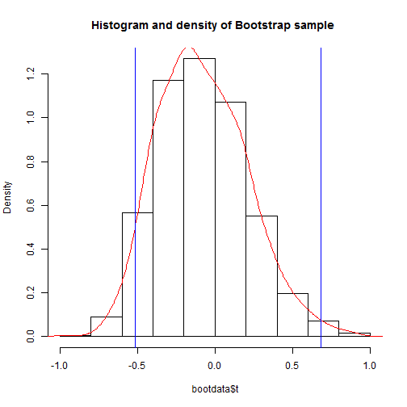
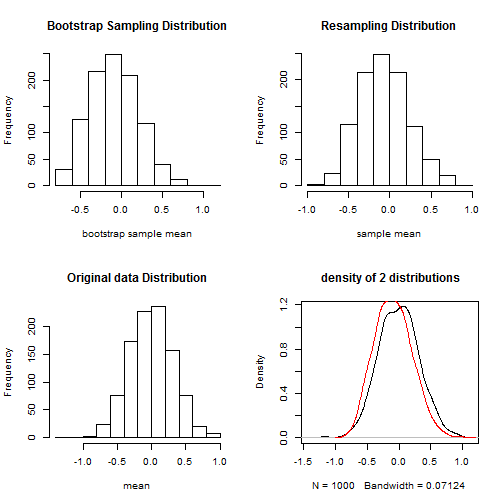

 # Bootstrap Statistical Computing


                                 ** Author: ABAS-Hamza ** 
                           
                           
                           
                           
                           
                           
                           
                           
                           
## Introduction To bootstrap

In 1979 B. Efron introduced the Bootstrap method. this technique would not be feasible without modern computing power. It is one of the most famous resampling technique to get confidence intervals in situations where classical approach (t- or z- tests) would fail. The idea of bootstrap is based roughly on the law of large numbers, which says, with enough data the empirical distribution will be a good approximation of the true distribution. We use The bootstrap technique because the  summary statistic like the sample mean will fluctuate from sample to sample and We would like to know the magnitude of these fluctuations. Then, We would get a fairly good idea about the sampling distribution of a particular statistic from resampling again and over again. Roughly speaking, Bootstrap is resampling of the same size n (data) with replacement, then We will have an empirical bootstrap sample with x_bar* the mean of an empirical bootstrap sample. Other than that We have to consider what resampling can't do. No matter Even with a fair amount of data the match between the true and empirical distributions will not be perfect, so there will be error in estimating the mean of the true N . but As long as they are reasonably close both the empirical and true distributions, We can relay on bootstrap technique for solving the distribtuion problem. 
For the next section We focus on how to utilize bootstrap for confidence interval using R, first We start with basic code and then We write a function which automatically solve the botstrap confidence intervall with visualisation.


### Set.seed is set so that the results are reproducible when someone verifies the code.


```r
set.seed(5)
```
### generate random numbers


```r
    mydata <- rnorm(10)
```

### In this case mydata variable is our true data


```r
    mydata
```

```
##  [1] -0.84085548  1.38435934 -1.25549186  0.07014277  1.71144087
##  [6] -0.60290798 -0.47216639 -0.63537131 -0.28577363  0.13810822
```

### Replicate the data 1000 times and calculate the mean of each 


```r
    k <- 1000
    mydata_mean <- replicate(k,mean(rnorm(10)))
    hist(mydata_mean, main ="Frequency of data")
    abline(v=mean(mydata_mean),col="red",lwd=2)
```



Now We sample from the true distribution with replacement, then
We will have an empirical bootstrap sample with x_bar* the mean of an empirical bootstrap sample


```r
  library(knitr)
  mysample <- replicate(k,sample(mydata, replace = TRUE))
  mysample_mean <- apply(mysample,2,mean)
  mysample_matrix <- matrix(data=mysample, nrow = k, ncol = 10)
  
  kable(head(mysample_matrix, align = "c"))
```

```
## Error in kable_markdown(x = structure(c("0.1381082", "-1.2554919", "-0.8408555", : the table must have a header (column names)
```

Now that We have the emperical distribution, We can compare theoretically the difference between the two distribution.


```r
par(mfrow = c(1,2))
hist(mysample_mean, main ="Frequency of Bootstrap Sample")
abline(v= mean(mysample_mean), lwd=2,col="red")
hist(mydata_mean, main ="Frequency of Data")
abline(v= mean(mydata_mean), lwd=2,col="red")
```



there is no big difference in the mean of the 2 distributions, The empirical distribution is approximating to the true distribution. We campare the density of the 2 distributions, the red ligne is the true distribution (mydata) and the black ligne is the emperical distribution. 


```r
 plot(density(mysample_mean), ylim = c(0.0,1.5),
      main =" density of 2 distributions") ; lines(density(mydata_mean), col="red")
```



The confidence interval of 95% using 2.5 and 97.5 percentiles


```r
   quantile(mysample_mean, c(0.025,0.975))
```

```
##       2.5%      97.5% 
## -0.5978723  0.4719997
```


In this section We use boot package. boot is an elegant and powerful tool for bootstrapping. the boot function takes several arguments such as data as a vector, matrix or data frame. If it is a matrix or data frame then each row is considered as one multivariate observation. Statistic which is A function which when applied to data returns a vector containing the statistic(s) of interest. and R which is The number of bootstrap replicates. Usually this will be a single positive integer. For importance resampling, some resamples may use one set of weights and others use a different set of weights. In this case R would be a vector of integers where each component gives the number of resamples from each of the rows of weights. these are the most used arguments but there are other arguments that I did not mention. We will also use the boot.ci function for **95%** confidence interval using **"Bias Corrected and Accelerated"** (BCa) method.


```r
library(boot)
 bootfunc <- function(x,i) {mean(x[i])}
 bootdata <- boot(mydata,bootfunc,k)

  bootdataCI <- boot.ci(bootdata, conf = 0.95, index = 1:min(2,length(bootdata$t0)),  
var.t = NULL, t0 = NULL, t = NULL, L = NULL, type = 'bca')
  
   bootdataCI
```

```
## BOOTSTRAP CONFIDENCE INTERVAL CALCULATIONS
## Based on 1000 bootstrap replicates
## 
## CALL : 
## boot.ci(boot.out = bootdata, conf = 0.95, type = "bca", index = 1:min(2, 
##     length(bootdata$t0)), var.t = NULL, t0 = NULL, t = NULL, 
##     L = NULL)
## 
## Intervals : 
## Level       BCa          
## 95%   (-0.5132,  0.6814 )  
## Calculations and Intervals on Original Scale
```

```r
   ci <- bootdataCI$bca[, c(4,5)]
```

### Next We view histograms (frequency and density), We Add kernel density line and We Add 95% confidence intervals.


```r
hist(bootdata$t, prob=TRUE, main ="Histogram and density of Bootstrap sample ") 
lines(density(bootdata$t), col="red")
abline(v=ci, col="blue")
```



Here is a function We Created for later computation, **x** is Dataset from which statistics will be calculated and **k** is the Number of bootstrap samples 


```r
myfunction <- function(x,k) {
        
        if (k > 100000) {
                error <- "Please Make sure no more than 100000 similations"
                return(error)
        }
                
              mysampleb <- numeric(k)
              mydatab <- numeric(k)
              
              for(i in 1:k) {
               mysampleb [i] <- mean(sample(x,replace = TRUE))
               mydatab [i] <- mean(rnorm(10))
                      
                 
              }
              
              library(boot)
              forbot <- function(data1,i) {
                      mean(data1[i])
              }
              
               mysampleb_boot <- boot(x,forbot,k)
        mysample_CI <- boot.ci(mysampleb_boot, conf = 0.95, 
        index = 1:min(2,length(mysampleb_boot$t0)),var.t = NULL,
        t0 =NULL, t = NULL, L = NULL, type = 'bca')
        CI <- mysample_CI$bca[,c(4,5)]
        
        par(mfrow = c(2,2))
                 hist(mysampleb_boot$t, main ="Bootstrap Sampling Distribution",
                 xlab ="bootstrap sample mean")
                 hist(mysampleb,main ="Resampling Distribution", xlab ="sample mean")
                 hist(mydatab,main ="Original data Distribution", xlab ="mean")
                 plot(density(mydatab), main =" density of 2 distributions")
        
                 lines(density(mysampleb_boot$t), col="red")
        mysample_CI
        CI
        return(list(CI_data = mysample_CI, confidenceI = CI))
        
}
```

### Now We can call the function above and use at any time


```r
myfunction(mydata,1000)
```



```
## $CI_data
## BOOTSTRAP CONFIDENCE INTERVAL CALCULATIONS
## Based on 1000 bootstrap replicates
## 
## CALL : 
## boot.ci(boot.out = mysampleb_boot, conf = 0.95, type = "bca", 
##     index = 1:min(2, length(mysampleb_boot$t0)), var.t = NULL, 
##     t0 = NULL, t = NULL, L = NULL)
## 
## Intervals : 
## Level       BCa          
## 95%   (-0.5641,  0.6234 )  
## Calculations and Intervals on Original Scale
## 
## $confidenceI
##                       
## -0.5640931  0.6234168
```
