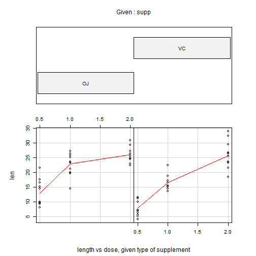
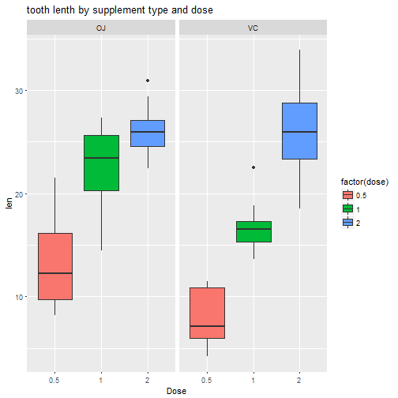

                # Analysis of Tooth Growth by Supplement and Dosage Using R


                                     
                                  ** Author: ABAS-Hamza **                                  
      
      


      
      
      
      
      
# Overview

In this project I am going to analyze The Effect of Vitamin C on Tooth Growth in Guinea Pigs. The data set gives the results of an experiment to determine the effect of two supplements. The response is the length of odontoblasts (cells responsible for tooth growth) in 60 guinea pigs. Each animal received one of three dose levels of vitamin C (0.5, 1, and 2 mg/day) by one of two delivery methods, (orange juice or ascorbic acid (a form of vitamin C and coded as VC).the data frame has 60 observations on 3 variables.


# Looking at Data
Let's start first loading the data.

[anchor in square brackets, then the link
in parentheses](#anchor)


```r
data("ToothGrowth")
```


```r
dim(ToothGrowth)
```

```
## [1] 60  3
```

Let's look at the structure of the ToothGrowth data set:


```r
str(ToothGrowth)
```

```
## 'data.frame':	60 obs. of  3 variables:
##  $ len : num  4.2 11.5 7.3 5.8 6.4 10 11.2 11.2 5.2 7 ...
##  $ supp: Factor w/ 2 levels "OJ","VC": 2 2 2 2 2 2 2 2 2 2 ...
##  $ dose: num  0.5 0.5 0.5 0.5 0.5 0.5 0.5 0.5 0.5 0.5 ...
```

### Basic Descriptive and Exploratory Data Analysis


```r
summary(ToothGrowth)
```

```
##       len        supp         dose      
##  Min.   : 4.20   OJ:30   Min.   :0.500  
##  1st Qu.:13.07   VC:30   1st Qu.:0.500  
##  Median :19.25           Median :1.000  
##  Mean   :18.81           Mean   :1.167  
##  3rd Qu.:25.27           3rd Qu.:2.000  
##  Max.   :33.90           Max.   :2.000
```

We then perform some basic exploratory data analyses, in this case We use booxplot


```r
boxplot(ToothGrowth$len ~ ToothGrowth$supp)
```


The plot shows that the average of tooth growth for orange juice is more than vitamin C. The plot bellow also shows The difference in the mean.


```r
require(graphics)
coplot(len ~ dose | supp, data = ToothGrowth, panel = panel.smooth,
 xlab = "length vs dose, given type of supplement")
```



Now we find a summary statistics of tooth growth by supplement:


```r
library(dplyr)
library(knitr)
datagroup <- group_by(ToothGrowth,supp,dose)
sumdata <- summarise(datagroup, count= n(), 
mean = mean(len), median = median(len), "standar deviation" = sd(len))

sumfordata <- as.data.frame(sumdata)
kable(sumfordata, digits = 3 ,align = "c")
```


| supp | dose | count | mean  | median | standar deviation |
|:----:|:----:|:-----:|:-----:|:------:|:-----------------:|
|  OJ  | 0.5  |  10   | 13.23 | 12.25  |       4.460       |
|  OJ  | 1.0  |  10   | 22.70 | 23.45  |       3.911       |
|  OJ  | 2.0  |  10   | 26.06 | 25.95  |       2.655       |
|  VC  | 0.5  |  10   | 7.98  |  7.15  |       2.747       |
|  VC  | 1.0  |  10   | 16.77 | 16.50  |       2.515       |
|  VC  | 2.0  |  10   | 26.14 | 25.95  |       4.798       |

According to this result, the average tooth growth in both OJ and VC increase as dosage increases, And The average growth in orange juice is higher than the vitamin C category. To support the summary result, W use plot.


```r
library(ggplot2)
 plot <- ggplot(ToothGrowth, aes(x=factor(dose), y=len,fill=factor(dose))) + geom_boxplot() + 
facet_grid(.~ supp) + 
xlab("Dose") + ggtitle("tooth lenth by supplement type and dose")
 plot
```




# Hypothesis Testing 

The main purpose of this project is to test a hypothesis, And as mentioned in the project overview, the goal of this analysis is to analyze the effect of two supplements (Vitamin C and Orange Juice), each at three different doses (0.5, 1 or 2 mg) on tooth length in 60 guinea pigs. Each animal received one of three dose
levels of vitamin C (0.5, 1, and 2 mg/day) by one of two delivery methods, orange juice (coded as OJ) and ascorbic acid (a
form of vitamin C and coded as VC). In The previous section, We demonstrated the difference in the average for both types of supplement (OJ,VC). In this section We perform several hypothesis test. 

In order to undertake hypothesis testing We need to express our research hypothesis as a null and alternative hypothesis. In this case

**Null Hypotheses (H0)**: Assumes that there is no Difference in the average of the 2 supplement, and that the OJ supp did not increase the tooth length of the animal.    

**Alternative Hypothesis (HA)**: Assumes that there is Difference in the average of the 2 supplement, and that the OJ supp did increase the tooth length of the animal than the VC. We reject the Null Hypotheses.


First we explore the effect of supplement type on tooth growth by performing a two independent-sample t-test with **alph = 0.05** or **C = 95%**


```r
t.ratio <- t.test(len~supp, data = ToothGrowth)
t.result <- data.frame("t.ratio" = t.ratio$statistic,
                        "df"   = t.ratio$parameter,
                        "P.value" = t.ratio$p.value,
                        "Lower.Conf.Interval" = t.ratio$conf.int[1],
                        "upper.Conf.Interval" = t.ratio$conf.int[2],
                        "OJ.mean" = t.ratio$estimate[1],
                        "VC.mean" = t.ratio$estimate[2],
                        row.names = "OJ vs VC ")
kable(t.result,align = "c",digits = 4, caption = "tooth growth by supplement")
```


|         | t.ratio |   df    | P.value | Lower.Conf.Interval | upper.Conf.Interval | OJ.mean | VC.mean |
|:--------|:-------:|:-------:|:-------:|:-------------------:|:-------------------:|:-------:|:-------:|
|OJ vs VC | 1.9153  | 55.3094 | 0.0606  |       -0.171        |        7.571        | 20.6633 | 16.9633 |

The level of statistical significance is often expressed as the so-called p.value, In this case our P.value is **0.0606** which is greater than the **alpha**. Therefor We do not reject the Null hypothesis and there is no statistical significance between the 2 supplement


# Testing tooth length by supplement and dosage

Now We explore the effect of supplement type by dosage, We know that each type of supplement contains 3 levels of dose (0.5,1.0,2).We assume **alpha = 0.05** and unequal variances.  

First We make 3 separate data grouped by dose and then perform a two-sample t-test 


```r
for0.5mg <-  subset(ToothGrowth, dose== 0.5)
for1mg <-  subset(ToothGrowth, dose== 1.0)
for2.0mg <-  subset(ToothGrowth, dose== 2.0)

t0.5 <- t.test(len~supp, data = for0.5mg)
test1 <- t.test(len~supp, data = for1mg)
test2 <- t.test(len~supp, data = for2.0mg)

t.result2 <- data.frame(
        "t.ratio"= c(t0.5$statistic,test1$statistic,test2$statistic),
        "df" = c(t0.5$parameter,test1$parameter,test2$parameter),
        "p.value"  = c(t0.5$p.value,test2$p.value,test2$p.value),
"Lower.Conf.Interval"= c(t0.5$conf.int[1],test1$conf.int[1],test2$conf.int[1]),
"upper.Conf.Interval"= c(t0.5$conf.int[2],test1$conf.int[2],test2$conf.int[2]),
"OJ.mean" = c(t0.5 $estimate[1],test1$estimate[1],test2$estimate[1]),
"VC.mean" = c(t0.5$estimate[2],test1$estimate[2],test2$estimate[2]),
row.names = c("OJ vs VC at 0.5mg", "OJ vs VC at 1.0mg", "OJ vs VC at 2.0")
)

kable(t.result2 , align = "c", digits = 4, caption ="Summary of two sample t-test for tooth growth by supplement and dosage")
```


|                  | t.ratio |   df    | p.value | Lower.Conf.Interval | upper.Conf.Interval | OJ.mean | VC.mean |
|:-----------------|:-------:|:-------:|:-------:|:-------------------:|:-------------------:|:-------:|:-------:|
|OJ vs VC at 0.5mg | 3.1697  | 14.9688 | 0.0064  |       1.7191        |       8.7809        |  13.23  |  7.98   |
|OJ vs VC at 1.0mg | 4.0328  | 15.3577 | 0.9639  |       2.8021        |       9.0579        |  22.70  |  16.77  |
|OJ vs VC at 2.0   | -0.0461 | 14.0398 | 0.9639  |       -3.7981       |       3.6381        |  26.06  |  26.14  |


The p-values of OJ and VC at **0.5 mg** and **1.0 mg ** are less than **alpha**. We conclude that there is a significant difference. But for 2 mg doasag there is no significant difference in the difference between their averages.

Our statistical analysis shows that the low levels of dosage (0.5 & 1.0) of orange juice are effective in tooth growth comparing to vitamin C and the p.values for **(0.5mg - 1.0mg )** are below the cut-off value we have set **(0.05 )**, Therfore we reject the null hypothesis and accept the alternative hypothesis. However the result from higher dosage (2.0) did not yield any significant outcome. 
